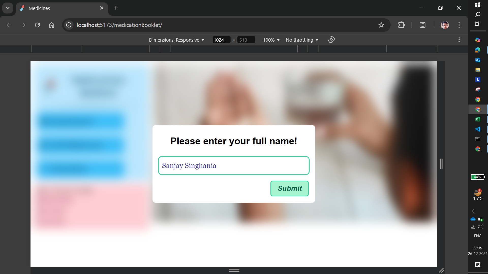
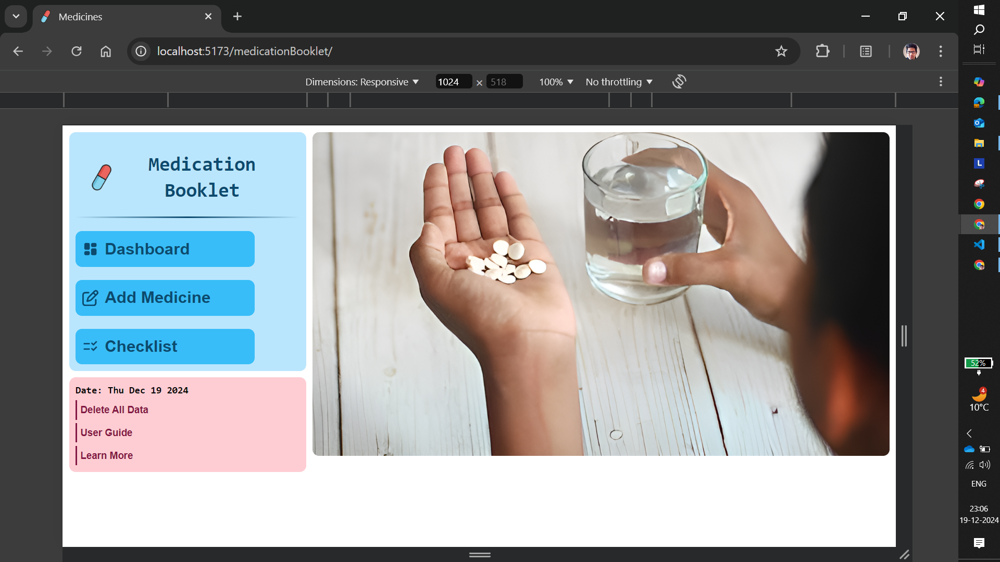
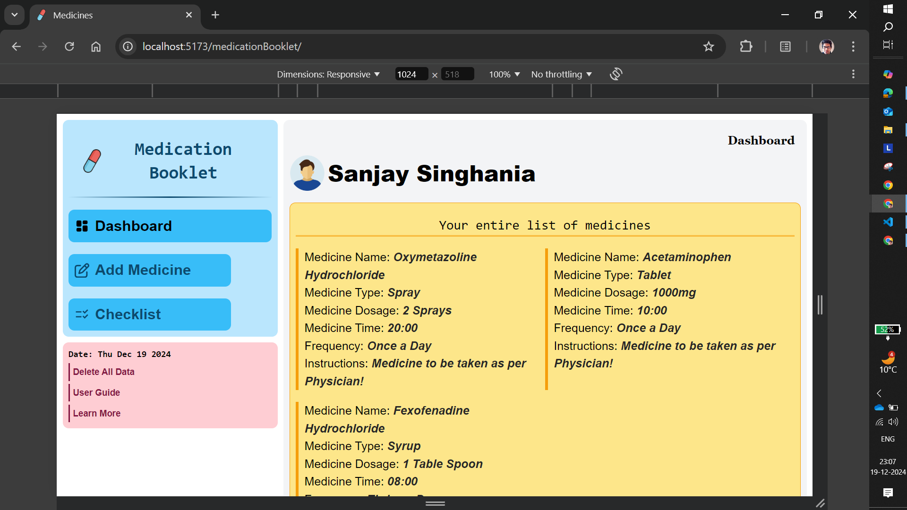
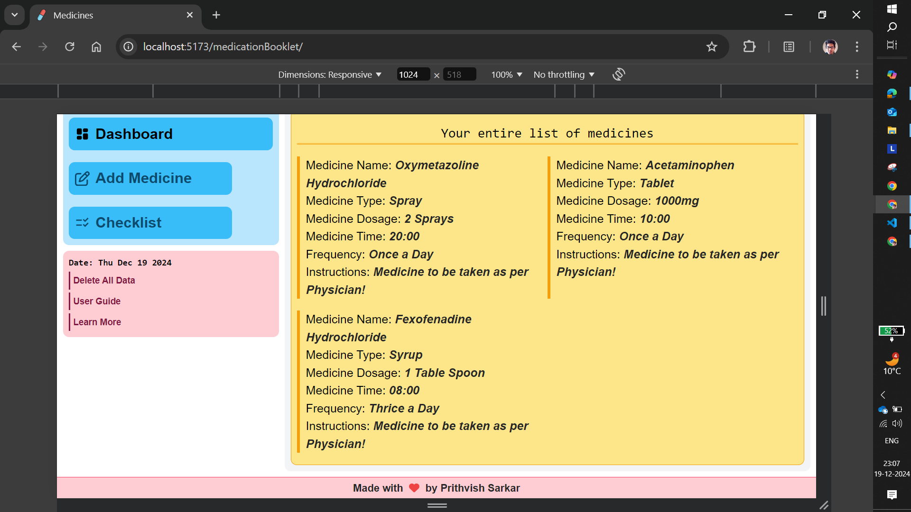
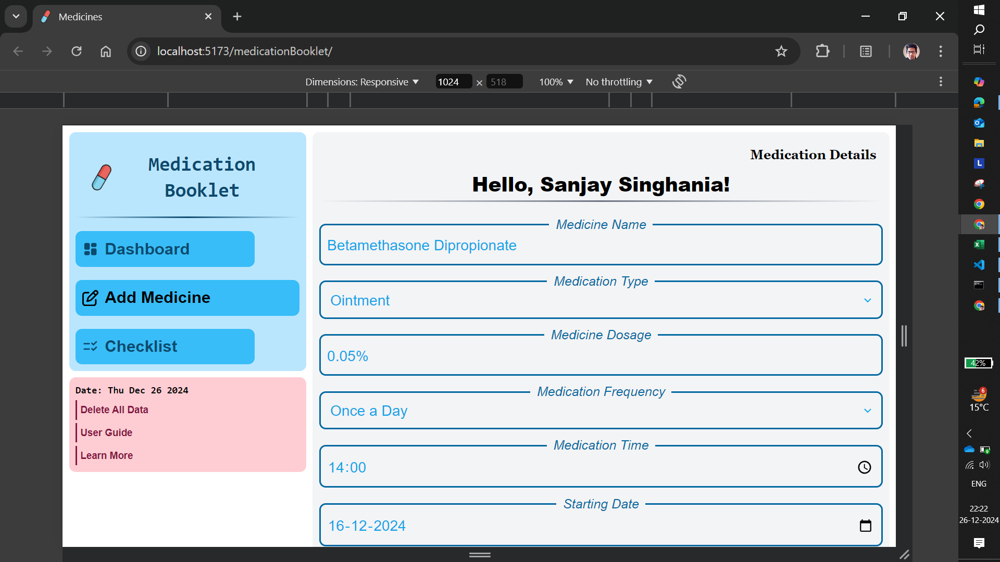
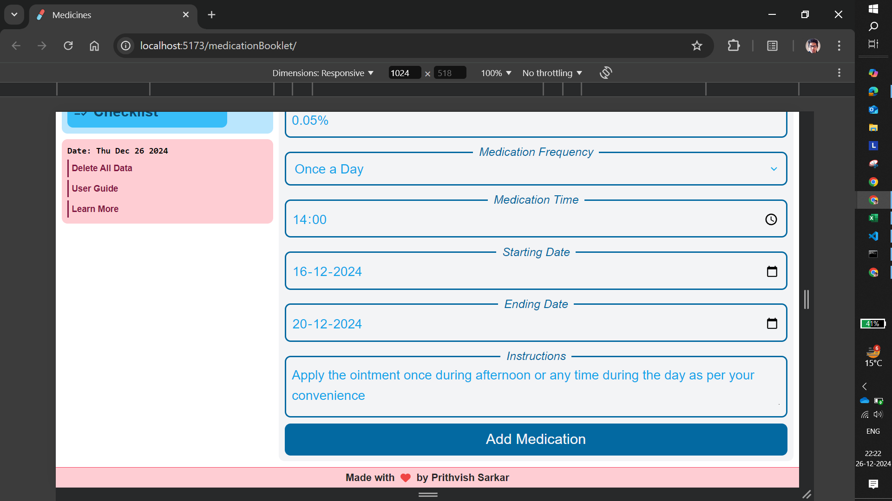
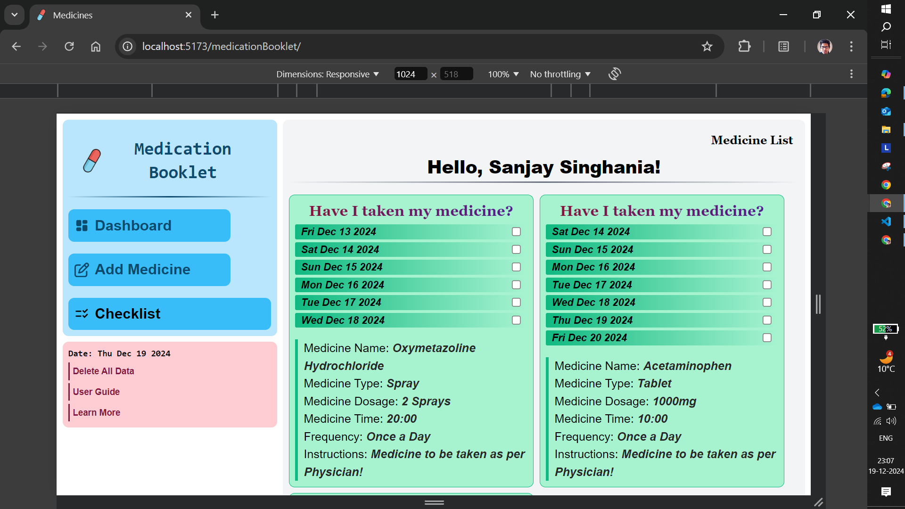
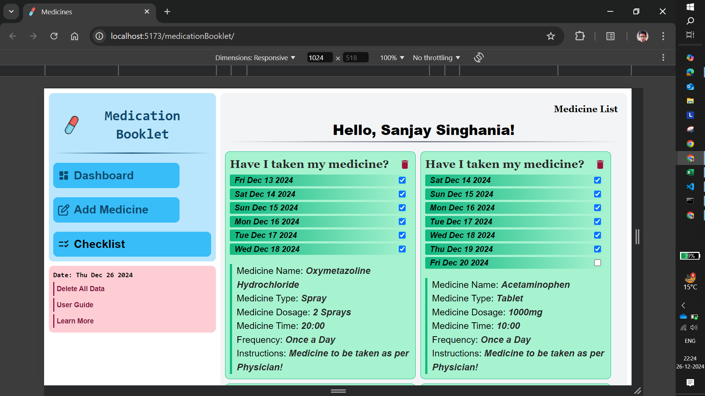
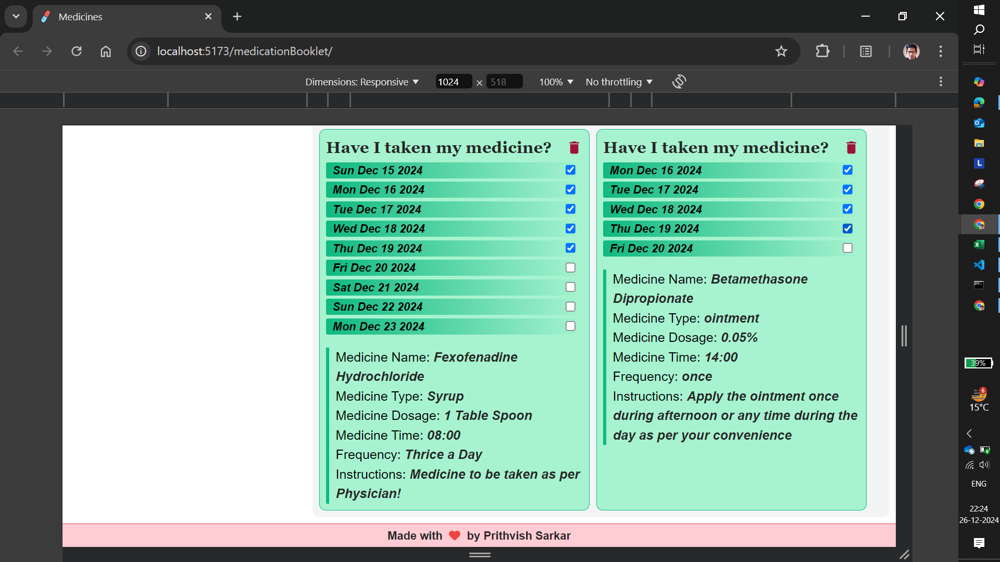
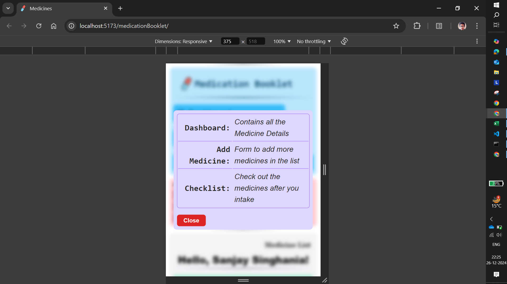

# Medication Booklet Application

The Medication Booklet Application is a user-friendly tool designed to help users manage their medications effectively. With features like adding and viewing medication details, it provides a simple way to keep track of your medicine intake details.

## UI of the App

- Navigation Bar

  - Contains three buttons: Dashboard, Add Medicine, and Checklist
  - The Cover Page is shown when the application mounts by default

- Permanent Layouts

  - The Navigation Bar and a Side Panel are permanent components of the app layout

- Side Panel

  - Contains three buttons: Delete All Data, User Guide, and Learn More
  - **Delete All Data**: Opens a modal asking for confirmation. Once confirmed, all application data is removed from Local Storage
  - **User Guide**: Opens a modal that guides the user on how to use the application
  - **Learn More**: Opens the GitHub repository for this application in a new tab

- Responsive Design

  - The application is highly responsive, ensuring usability across various devices
  - **On larger screens**: Main content is displayed on the right side
  - **On mobile devices**: Main content is displayed at bottom of the Navigation Bar
  - The Layout is inspired Dashboard User Interface

- Dashboard
  - The actual Dashboard section contains the user's medication details
  - All the medicine details are grouped and displayed in an eye-catching manner

## Interactivity of the App

- Username Modal
  -When the application is used for the first time, a modal opens asking for the user's full name

  - The username is stored in Local Storage and used throughout the application
  - On subsequent visits, the username is fetched from Local Storage, and the modal is not displayed

- Navigation Buttons

  - When clicking on any of the Navigation Buttons, the corresponding section is displayed
  - The Button UI (length and color) also changes

- Add Medicine Section

  - A form is provided where users can input details about their medications
  - Clicking the "Submit" button adds the medicine details, which are then visible in the Dashboard and in the Checklist section

- Checklist Section

  - Showcases detailed medication information accompanied by a sequence of checkboxes to track the medicine intake schedule
  - Checkboxes range from the Starting Date to the Ending Date, as provided in the "Add Medicine" section
  - As an example, consider a Starting Date of 15th March and an Ending Date of 22nd March, the Checklist section would generate cards displaying Date-Checkbox pairs for each date within this range and along with detailed information about the associated medicine
  - The checklist data is stored in Local Storage. When the app is reloaded, the data is fetched and displayed

- Real-Time Updates
  - When you add new medication details in the "Add Medicine" section, the application automatically updates the Dashboard and Checklist sections to keep all records synchronized
  - The app seamlessly incorporates new data into existing schedules, saving users from manual adjustments and making the process simple and efficient

## Application in Real Life

- It is particularly valuable for busy professionals and senior citizens who might forget their medications

- It can be used by caregivers to track medications for others or by individuals managing multiple prescriptions

## Technology Used

- **ReactJS** which is built using Vite for faster development
- **TailwindCSS** for styling and Mobile-First design approach
- **Local Storage** is used to persist data which ensures that medication details and user preferences are retained even after refreshing or closing the application

## Installation and Setup

- **Clone Repository**

```javascript
git clone https://github.com/prithvish774848474/medicationBooklet.git
cd medicationBooklet
```

- **Install Dependencies**: `npm install`
- **Start the Development Server**: `npm run dev`

## How to use the App?

- Launch the Application
- Use the Navigation Bar to navigation throughout the App
- **Dashboard**: View all your medicine details
- **Add Medicine**: Fill in the medication details in the provided form and click "Submit" to add new prescribed medicine in the bucket
- **Checklist**: View and manage medication intake routines with checkboxes for each date in the range specified during medicine addition
- **Side Panel**: Use the Side Panel buttons for additional actions like deleting all data or accessing the user guide

## Acknowledgements

- ReactJS Documentation: [React](https://react.dev/learn)
- TailwindCSS Documentation: [TailwindCSS](https://tailwindcss.com/docs/installation)

## Application UI Instances










