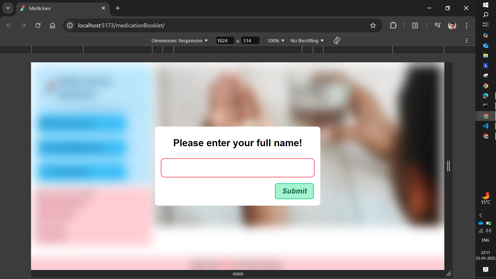

# Medication Booklet Application

The Medication Booklet Application is a user-centric tool designed to assist users in managing their medications efficiently. It features intuitive options for adding, viewing, and removing medication details, enabling users to stay on top of their medical routines effortlessly.

## UI of the App

- **Navigation Bar**

  - Contains four buttons: *Dashboard*, *Add Medicine*, *Checklist*, and a *Hamburger Icon* (visible only on smaller screens like mobile devices)
  - By default, the application displays the Cover Page when it launches

- **Side Panel**
  
  - Visible on larger screens and hidden by default on smaller screens
  - It can be toggled on or off using the *Hamburger Icon*
  - Includes four functional buttons:-

    - **Delete All Data**: Opens a confirmation modal to clear all data stored in Local Storage
    - **User Guide**: Opens a modal with a step-by-step guide on how to use the application
    - **Learn More**: Redirects users to the application's GitHub repository in a new tab
    - **Enable/Disable Notifications**:-

      - *Default value*: Enable Notifications
      - When clicked by the user, it requests *Notification Permission*, registers a *Service Worker*, and sets up *Push Notifications* to remind users about their medication schedule

      - Once enabled, the button switches to *Disable Notifications*, allowing users to stop *Push Notifications* and unregister the *Service Worker*

- **Responsive Design**

  - The application is highly responsive, ensuring usability across various devices
  - **On larger screens**: The *Navigation Bar* and *Side Panel* are always visible on left side and the main content displayed on the right side

  - **On mobile devices**: The *Side Panel* is hidden by default and can be toggled using the *Hamburger Icon* and the main content displayed below the Navigation Bar

- **Dashboard**
  - Displays all medication details in an organized and visually appealing format
  - Offers an at-a-glance overview of the user's medicine intake schedule

## Interactivity of the App

- **Username Modal**
  - When accessed for the first time, a *Modal* prompts the user to enter their full name
  - The username is stored in the *Browser's Local Storage* and is automatically retrieved during subsequent visits

- **Navigation Buttons**

  - Clicking any navigation button dynamically displays the corresponding section
  - The buttons visually update (e.g., color and size) to indicate the selected state

- **Add Medicine Section**

  - A form is provided where users can input details about their medications
  - Clicking *"Submit"* sends the data to the *Backend Server*
  - The user also receives *Push Notifications* for the newly added medicine along with previous medicines, provided that the *Push Notifications* is turned on

- **Checklist Section**

  - Displays detailed medication information accompanied by a sequence of checkboxes to track the medicine intake schedule

  - Checkboxes range from the *Starting Date* to the *Ending Date*, as provided in the *Add Medicine* section

  - For example, if the *Starting Date is 15th March* and the *Ending Date is 22nd March*, the Checklist section generates cards displaying *Date - Checkbox* pairs for each date in this range along with the associated medication details

  - The data is stored in Local Storage, ensuring persistence across sessions
  - Users can delete a specific medication by clicking the *Bin Icon* which removes it from both the UI and Local Storage

- **Push Notifications**

  - The **Enable Notifications** button in the **Side Panel** allows users to receive reminders for their medication schedules

  - Notifications are sent using a registered **Service Worker**
  - The button toggles to **Disable Notifications** once enabled which allowing users to stop receiving reminders by unregistering the **Service Worker**

- **Real-Time Updates**

  - When you add new medication details in the **Add Medicine** section, the application automatically updates the **Dashboard** and **Checklist** sections to keep all records synchronized

  - The app seamlessly incorporates new data into existing schedules, saving users from manual adjustments and making the process simple and efficient

## Application in Real Life

- This application is build for all and especially for:-

  - Busy professionals or senior citizens who may struggle to remember their medication
  - Caregivers managing prescriptions for others
  - Individuals with multiple medications requiring precise scheduling

## Technology Used

- **ReactJS**: Built with *Vite* for a faster development experience
- **TailwindCSS**: Used for responsive and mobile-first design
- **Local Storage**: Ensures data persistence, storing medication details and user preferences even after the app is closed

- **Push Notifications**: Handles Push Notifications for medication reminder
- **Backend Integration**: Stores medication data and facilitates seamless notifications

## Installation and Setup

- **Clone Repository**

```bash
git clone https://github.com/prithvishsarkar/medicationBooklet.git
cd medicationBooklet
```

- **Backend Setup**

  - Navigate to Backend Repository: `cd Backend`
  - Install Dependencies: `npm install`
  - Start the Backend Development Server: `npm run dev`

- **Frontend Setup**

  - Use a new terminal for Frontend
  - Navigate to Frontend Repository: `cd Frontend`
  - Install Dependencies: `npm install`
  - Start the Frontend Development Server: `npm run dev`

## How to use the App?

- **Launch the Application**: Enter your full name when prompted (only on the first visit)
- **Navigate via the App**: Use the *Navigation Bar* to switch between the *Dashboard*, *Add Medicine*, and *Checklist* sections

- **Dashboard**: Lists all the medication details of the user
- **Add Medicine**:

  - Fill in the required details in the form and click "Submit" to save your medication schedule
  - Data is sent to the backend, and notifications are enabled if permission is granted

- **Checklist**:

  - Track medication schedules with interactive checkboxes
  - Remove a specific medication using the *Bin Icon*

- **Side Panel**:

  - Delete all data
  - Access the user guide
  - Enable or Disable Notifications for medication reminders

## Acknowledgements

- ReactJS Documentation: [React](https://react.dev/learn)
- TailwindCSS Documentation: [TailwindCSS](https://tailwindcss.com/docs/installation)
- ExpressJS Documentation: [ExpressJS](https://expressjs.com/)
- Push Notifications: [Push Notifications](https://medium.com/@a7ul/beginners-guide-to-web-push-notifications-using-service-workers-cb3474a17679)

## Application UI Instances




